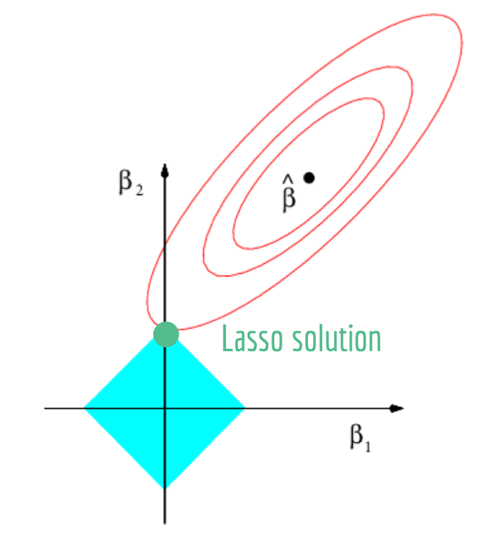
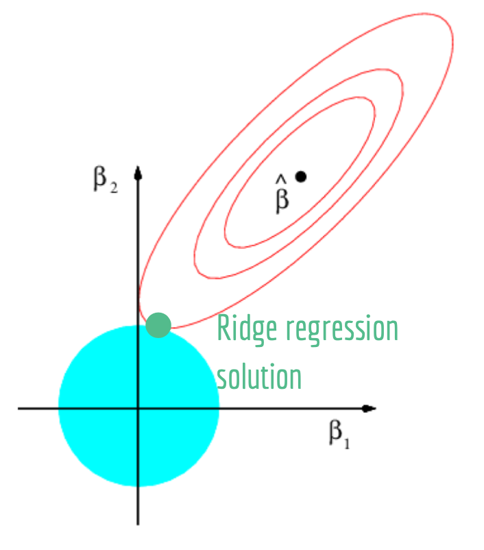

Ellery to do list:

  - finish background section!
  - add in bias and variance of OLS and ridge estimators --> describe connection to simulation for lasso
  - describe graph for simple case 
  - relationship between s and lambda ?? 
  - citations for background section and deriving estimators
  
Questions for Kelsey: 
  
  - last step for lasso simple case thing 

## Introduction

## Background

### Ordinary Least Squares Estimation

In ordinary least squares estimation (OLS), we attempt to find a linear model that best fits the data. Our model is a polynomial $\hat{y} = \beta_0 +\beta_1x_1 + \beta_2x_2 + \space ...  \space + \beta_nx_n$ with unknown coefficients $\beta_0, \space \beta_1, \space \beta_2, \space .., \space \beta_n$. In the method of least squares, we find the values of these coefficients that minimize the distance between the true $y$ values and the predicted $y$ values $\hat{y}$. We define this distance as a residual: $y_i- \hat{y}$. To get an overall estimate of the prediction error of our model, we compute the residual for each observation, square the residuals and sum these values. We can write this as:  

$$
\sum_{i=1}^n (y_i - \hat{y}_i)^2 = \sum_{i=1}^n (y_i - [\beta_0 +\beta_1x_1 + \space ...  \space + \beta_nx_n])^2 \\
= \sum_{i=1}^n ( y_i +\beta_0 - \sum_{j=1}^p \beta_jx_{ij} )^2
$$
We can summarize the least squares method as: 
$$
\text{argmin}_{\beta_0,..., \beta_n}\sum_{i=1}^n ( y_i +\beta_0 - \sum_{j=1}^p \beta_jx_{ij} )^2
$$
Instead of using standard mathematical notation, we can write linear models and the least squares method in matrix notation. In matrix notation, a linear model is written as: 

$$\mathbf{y} = \mathbf{X}\boldsymbol\beta  + \boldsymbol\epsilon, \text{ where } E[\boldsymbol\epsilon] = \mathbf{0}$$.

$\mathbf{y}$ is the vector of outcomes, $\boldsymbol\beta$ is the vector of covariates, and $\mathbf{X}$ is the matrix of covariates: 
$$\mathbf{y} = \begin{pmatrix} y_1 \\ y_2 \\ \vdots \\ y_n \end{pmatrix}; \space\boldsymbol\beta = \begin{pmatrix} \beta_0 \\ \beta_1 \\ \vdots \\ \beta_p \end{pmatrix}; \space \mathbf{X} = \begin{pmatrix} 1 & x_{11} & \cdots & x_{p1} \\ 1 & x_{12} & \cdots & x_{p2} \\ \vdots & \vdots & \ddots & \vdots \\ 1 & x_{1n} & \cdots & x_{pn} \end{pmatrix}.$$ 
The least squares estimation method then becomes: 

$$\text{argmin}_{\boldsymbol\beta} (\mathbf{y} - \mathbf{X}\boldsymbol\beta)^\top(\mathbf{y} - \mathbf{X}\boldsymbol\beta)$$.

### Problems with Ordinary Least Squares Estimation 

### Lasso
  Lasso is an adjustment to the linear regression framework. In a lasso model, the goal is the same as for OLS model: minimize the RSS. However, we add an additional penalty term, shown in red below, that limits the values of the coefficients. Specifically, lasso is defined as: 
  
  $$\text{argmin}_{\beta_j}\sum_{i=1}^n ( y_i +\beta_0 - \sum_{j=1}^p \beta_jx_{ij} )^2 + \color{red}{\lambda \sum_{j=1}^p |\beta_j|}$$
When minimizing this quantity as a whole, we are minimizing each component -- both the RSS and the penalty term. Minimizing the penalty term, for a given $\lambda$, has the effect of reducing the values of the coefficients towards zero. The constant $\lambda$ allows us to control how much the coefficients are shrunk towards zero and is thus considered a tuning parameter for lasso models. Large $\lambda$ values weight the penalty term heavily, so the coefficient values must be very small to minimize the overall function. Small $\lambda$ values reduce the importance of the penalty term allowing the coefficients to be larger. In the extreme, if $\lambda$ is infinitely large, the coefficients would all become zero; if $\lambda$ is zero, the coefficients would be the OLS solution. We discuss how to choose $\lambda$ in the next section.  

  There is an alternate formulation of lasso that reveals how it is a constrained optimization problem. In this formulation, we define lasso as: 
$$
\text{argmin}_{\beta_j}\sum_{i=1}^n ( y_i +\beta_0 - \sum_{j=1}^p \beta_jx_{ij} )^2  \text{; subject to }  \sum_{j=1}^p |\beta_j| \le s.
$$
In this formulation it is clear that the goal remains to minimize the RSS; however, the values of the coefficients are subjected to an additional constraint. Instead of using the tuning parameter $\lambda$, the tuning parameter $s$ is used. For large values of $s$, the coefficients are unconstrained and can have large values. Small values of $s$ impose a tight constraint on the coefficients, forcing them to be small. 
  With this formulation of lasso, we can visualize the relationship between the RSS and the constraint in a two predictors setting. With two predictors, the constraint region is defined as $|\beta_1| + |\beta_2| \le s$; this is a diamond with height $s$. In the graph below, the blue diamond is the constraint region, the red ellipses represent contour lines of the RSS, and $\hat{\beta}$ is the OLS solution (the absolute minimum of the RSS). In a lasso model, the goal is to find the smallest RSS that is within the constraint region; in this graph, that is the point where the ellipses intersect the diamond at its top corner. 
  


**relationship between s and lambda???**

### Selecting the Tuning Parameter


### Comparison to Ridge Regression
  Ridge regression is another technique that modifies the OLS framework by constraining the values of the coefficients. Ridge regression is defined as: 
 $$\text{argmin}_{\beta_j}\sum_{i=1}^n ( y_i +\beta_0 - \sum_{j=1}^p \beta_jx_{ij} )^2 + \color{red}{\lambda \sum_{j=1}^p (\beta_j)^2}$$.
We can see that ridge regression is nearly identical to lasso; the only difference is in the penalty term (shown above in red). Instead of taking the absolute value of the coefficients, ridge regression squares the coefficients. 
  We can consider the constrained optimization formulation of ridge regression, as we did for lasso: 
$$
\text{argmin}_{\beta_j}\sum_{i=1}^n ( y_i +\beta_0 - \sum_{j=1}^p \beta_jx_{ij} )^2  \text{; subject to }  \sum_{j=1}^p (\beta_j)^2 \le s.
$$
With two predictors, the constraint region becomes a circle: $\beta_1^2 + \beta_2^2 \le s^2$. We can construct a very similar graph to the one above: 


  The only difference between lasso and ridge regression are their constraint regions. 

### Benefits of Lasso and Ridge Regression


## Main Results

### Deriving OLS, Ridge Regression and Lasso Estimators

#### OLS

As described above, the OLS problem can be written as $\text{argmin}_{\boldsymbol\beta} (\mathbf{y} - \mathbf{X}\boldsymbol\beta)^\top(\mathbf{y} - \mathbf{X}\boldsymbol\beta)$. 

We can derive the OLS estimate for $\boldsymbol\beta$: 
$$
\begin{aligned}

\text{argmin}_{\boldsymbol\beta} (\mathbf{y} - \mathbf{X}\boldsymbol\beta)^\top(\mathbf{y} - \mathbf{X}\boldsymbol\beta) \\ 

= \frac{\partial}{\partial \boldsymbol\beta} (\mathbf{y}^\top \mathbf{y} - \mathbf{y}^\top\mathbf{X}\boldsymbol\beta  - \boldsymbol\beta^T\mathbf{X}^Ty + \boldsymbol\beta^\top \mathbf{X}^\top \mathbf{X} \boldsymbol\beta) \\

= \frac{\partial}{\partial \boldsymbol\beta} (\mathbf{y}^\top \mathbf{y} - 2\mathbf{y}^\top\mathbf{X}\boldsymbol\beta + \boldsymbol\beta^\top \mathbf{X}^\top \mathbf{X} \boldsymbol\beta) \\

= -2\mathbf{X}^\top\mathbf{y} + 2 \mathbf{X}^\top \mathbf{X} \boldsymbol\beta \\

0 \stackrel{set}{=} -2\mathbf{X}^\top\mathbf{y} + 2 \mathbf{X}^\top \mathbf{X} \boldsymbol\beta \\

2 \mathbf{X}^\top \mathbf{X} \boldsymbol\beta = 2\mathbf{X}^\top\mathbf{y} \\ 

(\mathbf{X}^T\mathbf{X})^{-1}\mathbf{X}^\top \mathbf{X} \boldsymbol\beta = (\mathbf{X}^T\mathbf{X})^{-1} \mathbf{X}^\top\mathbf{y} \\ 

 \boldsymbol\beta = (\mathbf{X}^T\mathbf{X})^{-1} \mathbf{X}^\top\mathbf{y}

\end{aligned}
$$
#### Ridge Regression

In ridge regression, the formula we are trying to minimize is $\sum_{i=1}^n(y_i - \beta_0 - \sum_{j=1}^p\beta_j x_{ij})^2 + \lambda\sum_{j=1}^p \beta_j^2$. We can write this in matrix notation as: $(\mathbf{y} - \mathbf{X}\boldsymbol\beta)^\top(\mathbf{y} - \mathbf{X}\boldsymbol\beta) + \lambda \boldsymbol\beta^T\boldsymbol\beta$. We can minimize this in much the same way as in OLS: 

$$
\begin{aligned}

\text{argmin}_{\boldsymbol\beta} (\mathbf{y} - \mathbf{X}\boldsymbol\beta)^\top(\mathbf{y} - \mathbf{X}\boldsymbol\beta) + \lambda \boldsymbol\beta^T\boldsymbol\beta \\ 

= \frac{\partial}{\partial \boldsymbol\beta} (\mathbf{y}^\top \mathbf{y} - 2\mathbf{y}^\top\mathbf{X}\boldsymbol\beta + \boldsymbol\beta^\top \mathbf{X}^\top \mathbf{X} \boldsymbol\beta + \lambda \boldsymbol\beta^T\boldsymbol\beta) \\

= -2\mathbf{X}^\top\mathbf{y} + 2 \mathbf{X}^\top \mathbf{X} \boldsymbol\beta + 2\lambda\boldsymbol\beta \\

0 \stackrel{set}{=} -2\mathbf{X}^\top\mathbf{y} + 2 \mathbf{X}^\top \mathbf{X} \boldsymbol\beta + 2\lambda\boldsymbol\beta\\

\mathbf{X}^\top \mathbf{X} \boldsymbol\beta + \lambda\boldsymbol\beta = \mathbf{X}^\top\mathbf{y} \\ 

(\mathbf{X}^\top \mathbf{X} + \lambda\mathbf{I}) \boldsymbol\beta = \mathbf{X}^\top\mathbf{y} \\ 

(\mathbf{X}^\top \mathbf{X} + \lambda\mathbf{I}) (\mathbf{X}^\top \mathbf{X} + \lambda\mathbf{I}) ^{-1}\boldsymbol\beta = \mathbf{X}^\top\mathbf{y}(\mathbf{X}^\top \mathbf{X} + \lambda\mathbf{I}) ^{-1}\\ 

\boldsymbol\beta = \mathbf{X}^\top\mathbf{y}(\mathbf{X}^\top \mathbf{X} + \lambda\mathbf{I}) ^{-1}\\ 

\end{aligned}
$$


#### Considering a Simple Case
  We can consider a simple case: $\mathbf{X}$ is a diagonal matrix with 1's on the diagonals and 0's on all the off diagonals, the number of predictors equals the number of cases, and we force the intercept to go through the origin. This case allows us simplify our OLS and ridge regression estimators. For OLS, the solution is $\boldsymbol\beta = \mathbf{y}$ and for ridge regression the solution becomes $\boldsymbol\beta = \frac{\mathbf{y}}{1+\lambda}$. 
  Applying this simple case to find the estimators is helpful particularly for Lasso. Unlike OLS and Ridge Regression, there is no closed form solution for $\boldsymbol\beta$ for Lasso. To derive any estimators for Lasso, we must consider this simple case. 
  
#### Lasso Estimators in a Simple Case

For lasso, we can not find a general closed form solution for $\boldsymbol\beta$, so we will derive the lasso estimates for $\boldsymbol\beta$ for the simple case described above. We will not use matrix notation in order to easily apply the assumptions of our simple case. 

Remember that we can write the general form of lasso as: 

$$
\begin{aligned}

\text{argmin}_{\beta}\sum_{i=1}^n(y_i - \beta_0 - \sum_{j=1}^p\beta_j x_{ij})^2 + \lambda\sum_{j=1}^p |\beta_j|

\end{aligned}
$$
If we apply our simplifying assumptions, we can write:

$$
\begin{aligned}

\text{argmin}_{\beta}\sum_{j=1}^p(y_i - \beta_1)^2 + \lambda|\beta_1| 

\end{aligned}
$$

With these assumptions, we can find a closed form solution for $\beta$: 

$$
\begin{aligned}

\text{argmin}_{\beta}(y_i - \beta_1)^2 + \lambda|\beta_1| \\ 

= \frac{\partial}{\partial \beta} \left( (y_j - \beta_1)^2 + \lambda|\beta_1| \right) \\

= \frac{\partial}{\partial \beta} \left( y_j^2 - 2y_j\beta_1 + \beta_1^2 + \lambda|\beta_1| \right) \\

=  - 2y_j + 2\beta_1 + \lambda sign(\beta_1) \\

\end{aligned}
$$
To solve for $\beta_1$, we must consider different regions: (1) when $\beta_1 < 0$, (2) when $\beta_1 > 0$ and (3) when $\beta_1 = 0$.  

(1) when $\beta_1 < 0$ or when $y_j < - \lambda/2$: 

$$
\begin{aligned}

0 \stackrel{set}{=} - 2y_j + 2\beta_1 - \lambda \\

\beta_1 = y_j + \lambda/2 \\

\\
$$
(2) when $\beta_1 > 0$ or when $y_j > \lambda/2$: 
$$

0 \stackrel{set}{=} - 2y_j + 2\beta_1 + \lambda \\

\beta_1 = y_j - \lambda/2 \\

\\

$$
(3) when $\beta_1 = 0$ ASK KELSEY
$$

\text{when } \beta_1 = 0 \text{ or when }----: \\

0 \text{ when } |y_i| \le \lambda/2 


$$


#### Visualizing the Simple Case Estimators

```{r}
library(ggplot2)
lambda <- 5
ols <- function(x) x
ridge <- function(x) x/(1+lambda)
lasso <-function(x) ifelse(x > lambda/2, x-lambda/2,
   ifelse(x < -lambda/2, x+lambda/2, 
   ifelse( -lambda/2 <= x & x <= lambda/2, 0, 0)))


ggplot() +
  xlim(-10, 10)+
  geom_function(fun = ols,
                aes(color = 'OLS'),
                linetype = "dashed") +
  geom_function (fun = ridge,
                 aes(color = 'Ridge'),
                 lwd = 1.2)+
  geom_function(fun = lasso,
                aes(color = 'Lasso'),
                lwd = 1.2) +
  theme_bw()+
  theme(panel.grid.minor.x = element_blank(),
        panel.grid.minor.y = element_blank())+
  scale_color_manual(name = 'Models',
                     breaks = c('OLS', 'Ridge', 'Lasso'),
                     values = c('OLS'='gray54', 'Ridge'='olivedrab3', 'Lasso'='tan2'))+
  labs(y = "Coefficient Estimates", x = "yj")
  
```
DESCRIPTION OF WHAT THIS TELLS US 

### Simulation


